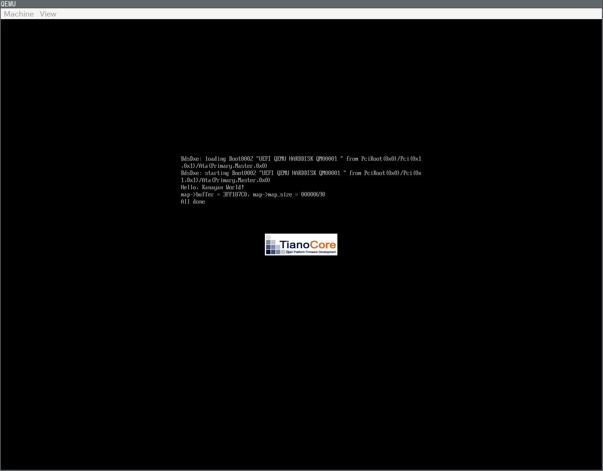

# 2日目
# 1. EDK2を利用したHello,Worldの作成
## 1.1. EDK2の取得
```
cd ~/Workspace
git clone --recursive git@github.com:tianocore/edk2.git
```
`--recursive`オプションをつけないとsubmoduleがダウンロードできず、BaseToolsのビルドに失敗する

## 1.2. EDK2 BaseToolsのビルド
```
$ cd ~/Workspace/edk2
$ make -C BaseTools/Source/C
```
※1.1と1.2の作業はmikanos-build内のplaybookで自動化されているが、自学のために手動で実行した。

## 1.3. プログラムの作成
- EDK2アプリ
  - [MikanLoaderPkg/Main.c](./MikanLoaderPkg/Main.c)
- コンポーネント定義ファイル
  - [MikanLoaderPkg/Loader.inf](./Loader.inf)
- パッケージ宣言ファイル
  - [MikanLoaderPkg/MikanLoaderPkg.dec](./MikanLoaderPkg/MikanLoaderPkg.dec)
- パッケージ記述ファイル
  - [MikanLoaderPkg/MikanLoaderPkg.dsc](./MikanLoaderPkg/MikanLoaderPkg.dsc)

## 1.4. プログラムのビルド
```
$ cd ~/Workspace/edk2
$ ln -s ../day02/MikanLoaderPkg ./
$ source edksetup.sh
```
生成されたConf/target.txtの以下の内容を変更する

|項目|値|
|--- |---|
|ACTIVE_PLATFORM | MikanLoaderPkg/MikanLoaderPkg.dsc|
|TARGET|DEBUG|
|TARGET_ARCH|X64|
|TOOL_CHAIN_TAG|CLANG38|

EDK2付属のbuildコマンド使用してビルドする.(コマンドの本体は`edk2/BaseTools/BinWrappers/PosixLike/build`)
```
$ cd ~/Workspace/edk2
$ build
```
`edk2/Build/MikanLoaderX64/DEBUG_CLANG38/X64/Loader.efi`に目的のファイルが生成される。


## 1.5. 動作確認
生成されたLoader.efiをQEMUで起動し、"Hello, Mikan World!"と出力されることを確認する。
```
$ cd ~/Workspace
$ run_qemu.sh edk2/Build/MikanLoaderX64/DEBUG_CLANG38/X64/Loader.efi
```

# 2. メモリマップの取得
## 2.1 概要
- BootSerivceのGetMemoryMapを使ってメモリマップを取得する。
- BootSerivceのOpenProtocolを使って取得したメモリマップをファイルに書き出す。

## 2.2 使った関数
### gBS->GetMemoryMap()
#### プロトタイプ宣言
```
typedef
EFI_STATUS
(EFIAPI *EFI_GET_MEMORY_MAP) (
  IN OUT UINTN *MemoryMapSize,
  OUT EFI_MEMORY_DESCRIPTOR *MemoryMap,
  OUT UINTN *MapKey,
  OUT UINTN *DescriptorSize,
  OUT UINT32 *DescriptorVersion
);
 ```

#### 使用例
```
  map->map_size = map->buffer_size;
  return gBS->GetMemoryMap(
      &map->map_size,
      (EFI_MEMORY_DESCRIPTOR *)map->buffer,
      &map->map_key,
      &map->descriptor_size,
      &map->descriptor_version);
```


### gBS->OpenProtocol()
#### プロトタイプ宣言
```
typedef
EFI_STATUS(EFIAPI *EFI_OPEN_PROTOCOL) (
  IN EFI_HANDLE      Handle,
  IN EFI_GUID        *Protocol,
  OUT VOID           **InterfaceOPTIONAL,
  IN EFI_HANDLE      AgentHandle,
  IN EFI_HANDLE      ControllerHandle,
  IN UINT32          Attributes 
);
```
#### 使用例
```
  EFI_LOADED_IMAGE_PROTOCOL *loaded_image;
  EFI_SIMPLE_FILE_SYSTEM_PROTOCOL *fs;

  gBS->OpenProtocol(
      image_handle,
      &gEfiLoadedImageProtocolGuid,
      (VOID **)&loaded_image,
      image_handle,
      NULL,
      EFI_OPEN_PROTOCOL_BY_HANDLE_PROTOCOL);

  gBS->OpenProtocol(
      loaded_image->DeviceHandle,
      &gEfiSimpleFileSystemProtocolGuid,
      (VOID **)&fs,
      image_handle,
      NULL,
      EFI_OPEN_PROTOCOL_BY_HANDLE_PROTOCOL);
```

### 2.2 動作確認

### 2.3 取得出来たメモリマップ
Index| Type| Type(name)| PhysicalStart| NumberOfPages| Attribute
---:|---:|---|---:|---:|---:
0| 3| EfiBootServicesCode| 00000000| 1| F
1| 7| EfiConventionalMemory| 00001000| 9F| F
2| 7| EfiConventionalMemory| 00100000| 700| F
3| A| EfiACPIMemoryNVS| 00800000| 8| F
4| 7| EfiConventionalMemory| 00808000| 8| F
5| A| EfiACPIMemoryNVS| 00810000| F0| F
6| 4| EfiBootServicesData| 00900000| B00| F
7| 7| EfiConventionalMemory| 01400000| 3AB36| F
8| 4| EfiBootServicesData| 3BF36000| 20| F
9| 7| EfiConventionalMemory| 3BF56000| 2448| F
10| 1| EfiLoaderCode| 3E39E000| 2| F
11| 4| EfiBootServicesData| 3E3A0000| 481| F
12| 3| EfiBootServicesCode| 3E821000| B7| F
13| A| EfiACPIMemoryNVS| 3E8D8000| C| F
14| 0| EfiReservedMemoryType| 3E8E4000| 16| F
15| 3| EfiBootServicesCode| 3E8FA000| F3| F
16| 6| EfiRuntimeServicesData| 3E9ED000| C4| F
17| 5| EfiRuntimeServicesCode| 3EAB1000| 6A| F
18| 7| EfiConventionalMemory| 3EB1B000| 247| F
19| 4| EfiBootServicesData| 3ED62000| CB9| F
20| 3| EfiBootServicesCode| 3FA1B000| 180| F
21| 5| EfiRuntimeServicesCode| 3FB9B000| 30| F
22| 6| EfiRuntimeServicesData| 3FBCB000| 24| F
23| 0| EfiReservedMemoryType| 3FBEF000| 4| F
24| 9| EfiACPIReclaimMemory| 3FBF3000| 8| F
25| A| EfiACPIMemoryNVS| 3FBFB000| 4| F
26| 4| EfiBootServicesData| 3FBFF000| 201| F
27| 7| EfiConventionalMemory| 3FE00000| FD| F
28| 4| EfiBootServicesData| 3FEFD000| 20| F
29| 3| EfiBootServicesCode| 3FF1D000| 20| F
30| 4| EfiBootServicesData| 3FF3D000| 9| F
31| 3| EfiBootServicesCode| 3FF46000| 12| F
32| 6| EfiRuntimeServicesData| 3FF58000| 20| F
33| A| EfiACPIMemoryNVS| 3FF78000| 88| F
34| B| EfiMemoryMappedIO| FFE00000| 200| 1
