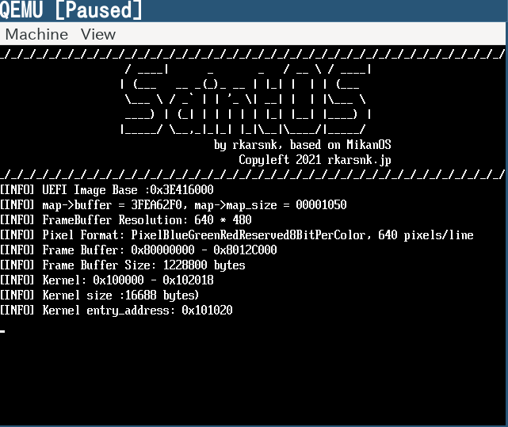

# GDBでEFIアプリケーションデバッグする
## DEBUG準備
UEFIモードで起動したQEMUで、debug.logを出力できるようにする。\
DEBUGに対応したOVMFが必要であるため、EDK2からビルドする。
```
$ cd edk2
$ make -C BaseTools/Source/C        <- buildに必要なC toolをビルド
$ source ./edksetup.sh
$ build -p OvmfPkg/OvmfPkgX64.dsc -b DEBUG -a X64 -t CLANG38
$ ls edk2/Build/OvmfX64/DEBUG_CLANG38/FV/ |grep OVMF
OVMF_CODE.fd
OVMF_VARS.fd
OVMF.fd
...
```

以下のオプションをつけてQEMUを起動する。
```
sudo qemu-system-x86_64 -m 1G \
   -drive if=pflash,format=raw,readonly,file=edk2/Build/OvmfX64/DEBUG_CLANG38/FV/OVMF_CODE.fd \
   -drive if=pflash,format=raw,file=edk2/Build/OvmfX64/DEBUG_CLANG38/FV/OVMF_VARS.fd \
   -drive if=ide,index=0,media=disk,format=raw,file=disk.img \
   -device nec-usb-xhci,id=xhci -device usb-mouse -device usb-kbd \
   -debugcon file:debug.log -global isa-debugcon.iobase=0x402 \
   -monitor stdio \
   -s
```
上のコマンドでは、みかん本のQEMU起動オプションに対して、以下の変更を加えています。
- OVMFファイルの差し替え
- `-debugcon file:debug.log -global isa-debugcon.iobase=0x402` の追加
- `-s`の追加．gdbserverをポート1234で起動する.

---
## `debug.log`から`Loader.efi`のベースアドレスを調べる
QEMUを起動すると以下のようなdebug.logが出力される
```
[debug.log]
Loading driver at 0x0003E416000 EntryPoint=0x0003E417CB9 Loader.efi
``` 

上の記述では，`Loader.efi`が `0x0003E416000` にロードされていることがわかる。また下の図からも`0x0003E416000`がLoader.efiのベースアドレスとなっていることがわかる．



---
## PEバイナリの情報を確認
gdbのinfo fileコマンドを使って，Loader.efiの情報を取得する
```
$ gdb Loader.efi
Reading symbols from Loader.efi...
(No debugging symbols found in Loader.efi)
(gdb) info file
Symbols from "Loader.efi".
Local exec file:
	`Loader.efi', file type pei-x86-64.
	Entry point: 0x1c3a
	0x0000000000000240 - 0x0000000000002f00 is .text
	0x0000000000002f00 - 0x00000000000030c0 is .data
	0x00000000000030c0 - 0x0000000000003100 is .reloc
```

`.text`,`.data`,`.reloc`領域の物理アドレス計算結果を以下に示す．

|領域     |仮想アドレス|物理アドレス|
|---     |--:       |--:|
|`.text `|`0x00240` |`0x0003E416240`|
|`.data `|`0x02f00` |`0x0003E418f00`|
|`.reloc`|`0x030c0` |`0x0003E4190c0`|

実際に`objdump -D Loader.efi`による逆アセンブル結果とQEMUでの逆アセンブル結果を比較すると，

### .text
```
Loader.efi:     ファイル形式 pei-x86-64
セクション .text の逆アセンブル:
0000000000000240 <.text>:
     240:       48 83 ec 28             sub    $0x28,%rsp
     244:       48 8b 57 08             mov    0x8(%rdi),%rdx
     248:       48 85 d2                test   %rdx,%rdx
     24b:       74 2b                   je     0x278
```
```
(qemu) x /4xi 0x003E416240
0x3e416240:  48 83 ec 28              subq     $0x28, %rsp
0x3e416244:  48 8b 57 08              movq     8(%rdi), %rdx
0x3e416248:  48 85 d2                 testq    %rdx, %rdx
0x3e41624b:  74 2b                    je       0x3e416278
```
---
### .data
```
セクション .data の逆アセンブル:
0000000000002f00 <.data>:
    2f00:       68 1d 00 00 00          pushq  $0x1d
    2f05:       00 00                   add    %al,(%rax)
    2f07:       00 94 1d 00 00 00 00    add    %dl,0x0(%rbp,%rbx,1)
    2f0e:       00 00                   add    %al,(%rax)
```
```
(qemu) x /4xi 0x0003E418f00
0x3e418f00:  68 7d 41 3e 00           pushq    $0x3e417d
0x3e418f05:  00 00                    addb     %al, (%rax)
0x3e418f07:  00 94 7d 41 3e 00 00     addb     %dl, 0x3e41(%rbp, %rdi, 2)
0x3e418f0e:  00 00                    addb     %al, (%rax)
```
---
### .reloc
```
セクション .reloc の逆アセンブル:
00000000000030c0 <.reloc>:
    30c0:       00 20                   add    %ah,(%rax)
    30c2:       00 00                   add    %al,(%rax)
    30c4:       40 00 00                add    %al,(%rax)
    30c7:       00 00                   add    %al,(%rax)
    30c9:       af                      scas   %es:(%rdi),%eax
```
```
(qemu) x /5xi 0x0003E4190c0
0x3e4190c0:  00 20                    addb     %ah, (%rax)
0x3e4190c2:  00 00                    addb     %al, (%rax)
0x3e4190c4:  40 00 00                 addb     %al, (%rax)
0x3e4190c7:  00 00                    addb     %al, (%rax)
0x3e4190c9:  af                       scasl    (%rdi), %eax
```

## DEBUG用のディスクイメージを作成する
以下のツリー構成になるように，QEMU用のディスクイメージ`debug.img`を作成する.

```
debug.img
├── Loader.efi
└── startup.nsh
```

startup.nshの内容は以下のとおり.
```
fs0:Loader.efi
```

## gdbscript
```
add-symbol-file ./Loader.debug 0x0003E416240 -s .data 0x0003E418F00
```


## 参考文献
- [How-to-run-OVMF (tianocore)](https://github.com/tianocore/tianocore.github.io/wiki/How-to-run-OVMF)
- [How to debug OVMF with QEMU using GDB (tianocore)](https://github.com/tianocore/tianocore.github.io/wiki/How-to-debug-OVMF-with-QEMU-using-GDB)
- [Debugging_UEFI_applications_with_GDB (wiki.osdev.org)](https://wiki.osdev.org/Debugging_UEFI_applications_with_GDB)
- [UEFI OVMF symbol load script for GDB (artem-nefedov/uefi-gdb)](https://github.com/artem-nefedov/uefi-gdb)
- [QEMUで実行されているGRUB2 EFIイメージをデバッグする](https://tutorialmore.com/questions-2526193.htm)
- [OVMFのデバッグ](https://retrage.github.io/2019/11/05/debugging-ovmf.html)
